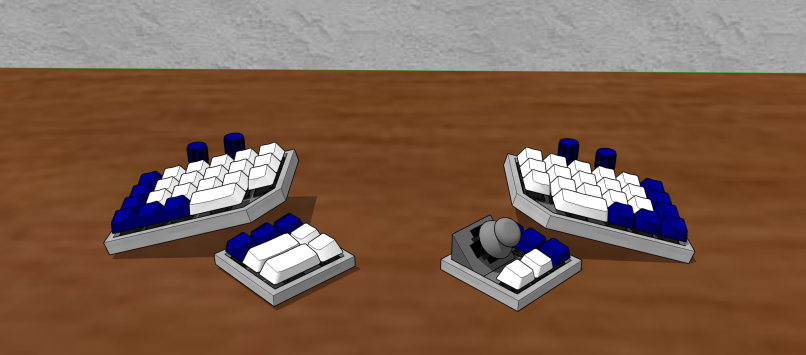

# Keeborg
*Oh look, another split keyboard*	

## Idea
Keeborg is a sandbox prototype inspired from split keyboards like ErgoDox, Iris, Sol2 and many others, that give your tumbs more to do besides spacebar mashing. Taking a level further with thoughts of rotary encoders, joysticks, trackballs and other input devices, rarely seen o na keyboard.

## Status
Currently working on modular plaid version of the base keyboard. 

Goal right now is to make a simple one-sided reversible pcb design that can be milled at home and put in a simple open-sandwich enclosure. Unused Arduino Pro signals are going to be routed to header pins, where a smaller pcb extension can be mounted. This way I can tryout switches, rotary encoders, joysticks, displays, LEDs and other componets that I would like to try out before putting in design.

For now, only base hand clusters are designed, thumb clusters come next.

