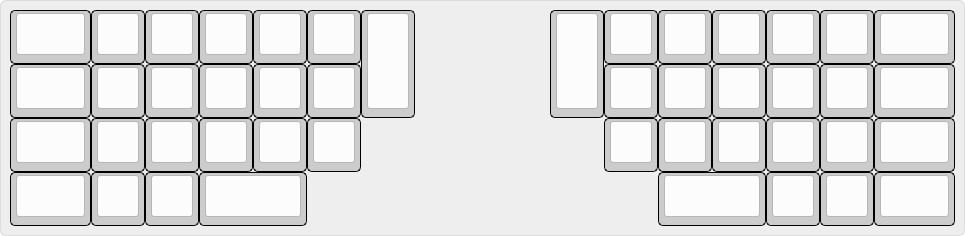

# Keeborg
*Oh look, another split keyboard*	

## Idea
Keeborg is a sandbox prototype inspired from split keyboards like ErgoDox, Iris, Sol2 and many others, that give your tumbs more to do besides spacebar mashing. Taking a level further with thoughts of rotary encoders, joysticks, trackballs and other input devices, rarely seen o na keyboard.

## Status
Designed a simple one-sided reversible PCB, made a fully functional thumb-less left-hand cluster. Had header connectors for some modular miny-pcb addons. After some testing decided it's not as expected nand abandoned the project. 

